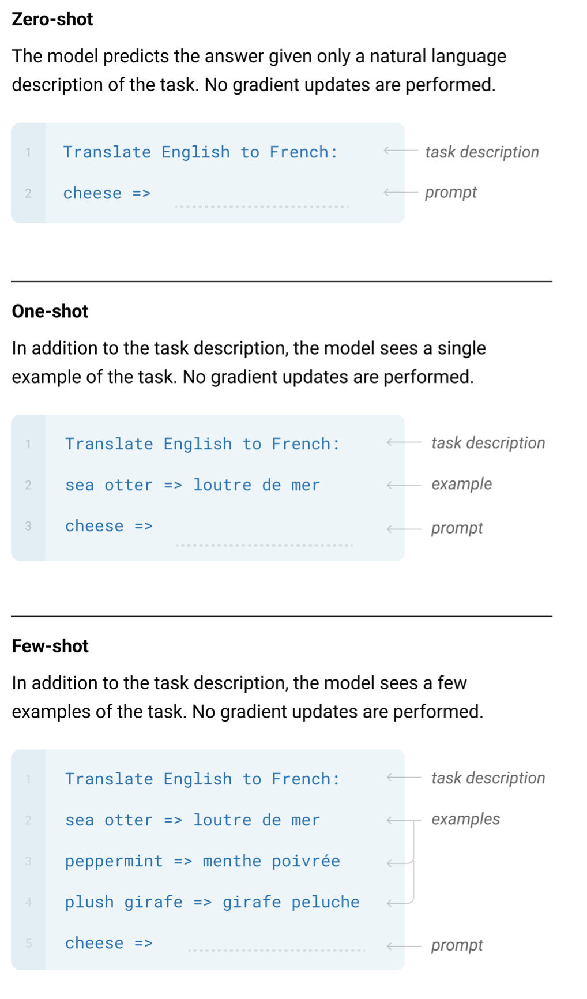
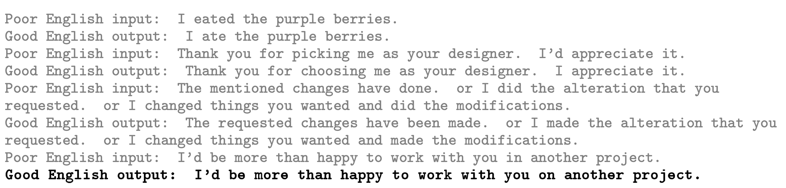
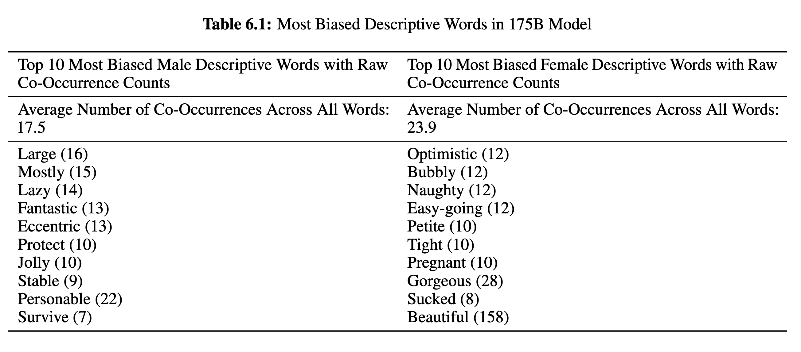
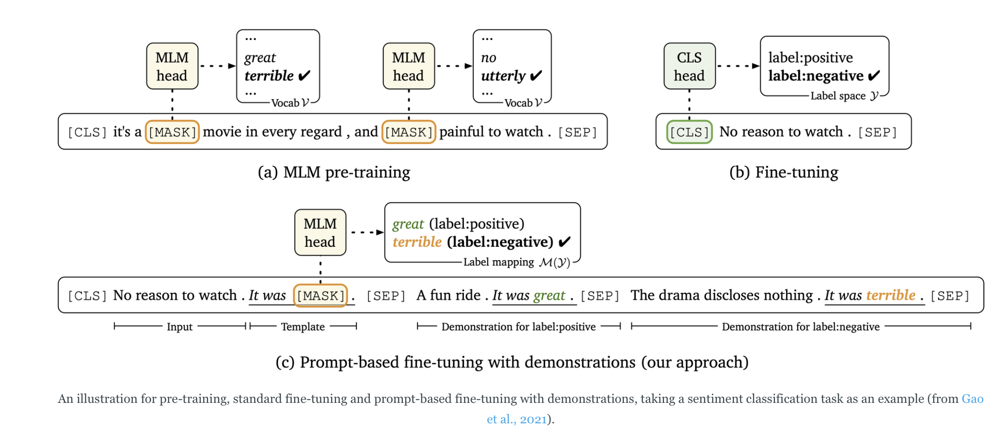

# <del> Probing  </del> Prompting


For this class we were initially going to talk about probing language models, where you try to predict e.g. part-of-speech tags, names or similar from the representations throughout the model, hereby revealing when the representation for the given task is formed. If you want to do this there is a tutorial [here](https://pageperso.lis-lab.fr/benoit.favre/pstaln/09_embedding_evaluation.html) and a [paper](https://arxiv.org/pdf/1905.05950.pdf). There is also a blog post [here](https://nlp.stanford.edu/~johnhew/interpreting-probes.html) on how to interpret these probes.

In a vague sense you can see probing as scanning studies on neural language models examining the intermediate representations formed by the system. We will in this class be talking about prompting, which examines the behaviour of language modelling. These can be used to both discern biases in models and to 'trick' the model to perform certain tasks.


## Plan:
- Introduction to probing and prompting
- Prompting using generative models and masked language models
- Prompting using huggingface
- Exercises
- last 30 minutes:
  - Presentations of prompts

## Exercises

1) For your exam project isolate a part of the project which can be formulated as a prompt.
2) Formulate 3-5 different prompts
   - Note that minor variations in prompts can significantly change the output so your 3-5 might look very similar
3) Create (or extract from a dataset) a few of examples which you want classified 
4) Which prompts perform the best? 
5) Discuss what improvements could be made? Could you average over mulitiple prompts or use multiple models? What about fine-tuning the model on prompts is that possible? ...

# Prompting
I will take inspiration from a few papers, especially the GPT-3 paper ["Language models are few-shot learners"](https://arxiv.org/pdf/2005.14165.pdf) and series of response papers, ["It is not just size that Matter: small language models are also few-shot learners"](https://arxiv.org/pdf/2009.07118.pdf), and ["Making Pre-trained Language Models Better Few-shot Learners"](https://arxiv.org/pdf/2012.15723.pdf). You might also be inspired by [this blog](https://thegradient.pub/prompting/) post on the gradient.
Prompting take slightly different forms depending on the language model, but in general the model looks somewhat like this:

## Prompting generative models
For generative language model, such as the GPT models the form they typically takes looks like this:



This can for example be used for spelling correction:



Here the prompt in th grayed out text while the bold in the text generated by the model.


Similarly you can also use this to examine the biases in the model:



Where the words are derived from prompts such as: 

> *"He was very", "She was very", "He would be described as", "She would be described as"*

## Prompting masked language models
The second paper instead of prompting generative language models created prompt for masked language models such as BERT.




# Masked language modelling with 🤗 Transformers

## Using masked language model

You can do masked language modelling with the transformers in two ways, either using the pipeline:

```python
from transformers import pipeline

model_name = "distilbert-base-uncased" # a small version of BERT

nlp = pipeline("fill-mask", model_name) # create pipeline

sentence_to_classify = "I love working with NLP"

prompt = f"""
I hate my life. => negative
The movie I saw yesterday was great! => positive
{sentence_to_classify} => {nlp.tokenizer.mask_token}
"""

print(prompt)
print(nlp(prompt))
```

Or more explicitly:

```python
from transformers import AutoModelForMaskedLM, AutoTokenizer
import torch

# download and load the tokenizer and model
tokenizer = AutoTokenizer.from_pretrained("distilbert-base-uncased")
model = AutoModelForMaskedLM.from_pretrained("distilbert-base-uncased")

# create prompt:
sentence_to_classify = "I love working with NLP" 
prompt = f"""
I hate my life. => negative
The movie I saw yesterday was great! => positive
{sentence_to_classify} => {tokenizer.mask_token}
"""

# tokenize the input
input = tokenizer.encode(prompt, return_tensors="pt")
mask_token_index = torch.where(input == tokenizer.mask_token_id)
mask_token_index = torch.where(input == tokenizer.mask_token_id)[1]  # record the index of the mask token

# forward pass through the model
token_logits = model(input).logits
token_logits.shape  # (batch_size, tokens, vocabulary) in this case it is (1, 30, 30522)

# extract the most likely word for the MASK
mask_token_logits = token_logits[0, mask_token_index, :]  # select the mask token
top_5_tokens = torch.topk(mask_token_logits, 5, dim=1).indices[0].tolist()

for token in top_5_tokens:
    print(tokenizer.decode([token]))
```

The nice thing about the second approach is that instead of taking the top 5 (which could potentially be anything), we can restrict it to only be e.g. positive or neutral.


## Generative models
You can also do this using generative models, these typically perform notably better with larger language models.

```python
from transformers import pipeline, set_seed
set_seed(42)

generator = pipeline('text-generation', model='gpt2')  # Note that a larger model is likely to produce a better result.

# new york times article
TEXT = """Covid: WHO says it is very worried about Europe surge

The World Health Organization (WHO) is "very worried" about the spread of Covid-19 within Europe as the continent battles a fresh wave of infections.
Speaking to the BBC, regional director Dr Hans Kluge warned that some 500,000 deaths could be recorded by March unless urgent action is taken.
Dr Kluge said introducing measures like mask wearing could immediately help.
The warning comes as several nations report record-high infection rates and introduce full and partial lockdowns.
Dr Kluge said factors like the winter season, insufficient vaccine coverage and the regional dominance of the more transmissible Delta variant were behind the spread. He called for increased vaccine uptake and the implementation of basic public health measures and new medical treatments to help fight the rise.
"Covid-19 has become once again the number one cause of mortality in our region," he told the BBC, adding "we know what needs to be done" in order to fight the disease.
Dr Kluge said mandatory vaccination measures should be seen as a "last resort" but that it would be "very timely" to have a "legal and societal debate" about the issue.

"Before that there are other means like the Covid pass," he said, adding that this is "not a restriction of liberty, rather it is a tool to keep our individual freedom."
Austria on Friday became the first European country to announce that Covid-19 vaccination would become a legal requirement. The new rules are set to come into force in February.
The announcement alongside that of a new national lockdown was made in response to record case numbers and low vaccination levels.
Many other European countries are also imposing new measures as cases rise.
Countries including the Czech Republic and Slovakia have also announced fresh restrictions on unvaccinated people as record infection rates are recorded across the continent.

Overnight, violent rioting erupted in Rotterdam in the Netherlands over new Covid-19 measures. Hundreds of protesters had gathered to show their anger at government plans for a more restrictions, and a ban on fireworks on New Year's Eve.
German Health Minister Jens Spahn has described the situation there as a "national emergency" and refused to rule another national lockdown out.
The UK recorded 44,242 new coronavirus cases on Friday.
The government has consistently said it has no plans for another lockdown, but has said it could bring in extra Covid measures in England to protect the NHS - known as Plan B - which include mandatory Covid passports for some indoor venues, compulsory face coverings in certain indoor settings and advice to work from home.
"""

prompt = "tl;dr"

output = generator(TEXT + prompt, 
                   max_length=630,  # max_length should be adaptable to model input size
                   num_return_sequences=1
                   )
# Output:
# tl;dr A ban on live fireworks at Christmas celebrations in London to protect the public will lead to further outbreaks 
# 'No one wants to have access to Covid-19'
```
