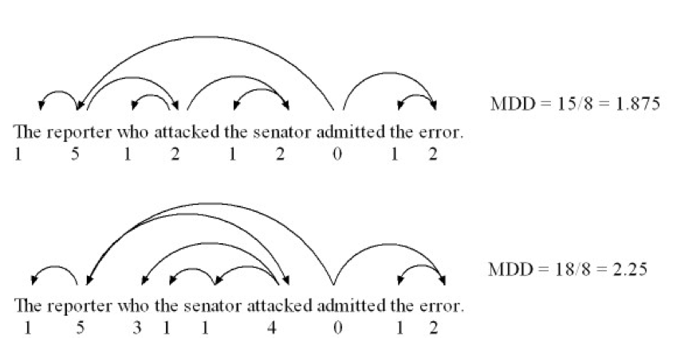

# Class 3: Working with Spacy

## Preparation for class

Summary, before the class you are required to:
- 1) have spacy and their English pipeline installed
- 2) have a corpus loader ready
- 3) read the quick introduction to spacy and solve the exercise at the end.


### spaCy
Before class you are required to have installed spacy. You can do this using:

```
pip install spacy
```

You can either set this up in a local virtual environment on your computer or in a Ucloud instance before class.

After you have installed spaCy you can install the English pipeline using:

```
python -m spacy download en_core_web_sm
```

Here the "en" stands for English, "web" that it is trained in web data and "sm" denotes that it is the small model. Feel free to also download the larger model as well:

```
python -m spacy download en_core_web_lg
```

When you have this downloaded you should be able to downloaded 
```
import spacy
nlp = spacy.load("en_core_web_sm")
doc = nlp("This is an English text")
```

We can expect this quite easily using, where we see that the output if the pipeline is a document class called `Doc`:
```
print(type(doc))
# <class 'spacy.tokens.doc.Doc'>
```

And that if you index the `Doc` you get a `Token` object.
```
token = doc[1]
print(token)
# is

print(type(token)))
# <class 'spacy.tokens.token.Token'>
```


What does this token contain? Well we can (like any other object in python) inspect it using the `dir`:
```
dir(token)
```

Which gives is a very long list of which should look something like this: `['_', '__bytes__', (...), 'is_digit', 'is_punct', 'whitespace_']` of all the attributes of the function. We could also just have looked at the [documentation](https://spacy.io/api/token), but that wouldn't teach you how to inspect a class. For example we can now check whether a token is a digit:

```
print(token.is_digit)
# False
```

You might also find a couple of other interesting things in there especially the `lemma_` which denotes the lemma of the token, `pos_` which denotes part-of-speech tag of the token and `ent_type_` which denote the entity type of the token.

**Exercise 1**:
Inspect the `doc`-object using `dir` and `type` along with the [documentation](https://spacy.io/api/Doc). You should before class have though i) about what is intended use (or benefit) of the `doc`-object ii) What are the two ways in which I can create an `Doc` object?

We will talk about this exercise as the first thing in the class.

### Corpus loader
Before the class, you should have a corpus loader ready. This should be able to read in each file in the folder `syllabus/classes/data/train_corpus` as a list of strings (or similar object).

```python
def corpus_loader(folder: str) -> List[str]:
    """
    A corpus loader function which takes in a path to a 
    folder and returns a list of strings.
    """
    # your code here
```

<details>
    <summary> Hints </summary>

You can use `os.listdir()` to list all the files in the directory.

```python
import os
path = "syllabus/classes/data/train_corpus"
list_of_files = os.listdir(path)
```

You can read in a singular file using:

```python
path_to_file = "syllabus/classes/data/train_corpus/1.txt"
with open(path_to_file) as f:
    document = f.read()

print(type(document))
# <class 'str'>
``` 

You can combine paths using `os.path.join()`.

</details>

<br /> 


## Plan for class

- 1) Talk about exercise 1
- 2) Filter a text to keep only the lemma of nouns, adjectives and verbs


<details>
    <summary> Deconstruction of the task </summary>

The task can meaningfully be deconstructed into a series of functions on the token level:
- A filter function, which decided if a token should be kept.
- A function which extract the lemma

These function can then be combined and used iteratively over the tokens of a document.


</details>

<br /> 

- 3) Calculate the ratio of pos-tags in texts. The ratios of pos-tags on other linguistic feature have for example been [linked](https://www.nature.com/articles/s41537-021-00154-3) to scizophrenia which e.g. use less adverbs, adjectives, and determiners (e.g., “the,” “a,”).

<details>
    <summary> Deconstruction of the task </summary>

The task can meaningfully be deconstructed into a series of functions:
- A function (or list comprehension) which takes a list of tokens (Doc) and extracts the pos tag for each
- A function which counts these. *Hint* look up the `Counter` class.

</details>

<br /> 

<del>4) If you get the time calculate PMI (see last weeks class) using the tokenization and sentence segmentation of spaCy.</del>

- 4) Calculate the mean dependency distance (MDD) for one of the texts. The mean dependency distance can be seen as a measure of lexical complexity, where higher mean dependency distance results in higher complexity ([Liu 2008](https://pdfs.semanticscholar.org/b6b9/cf00698a76d7a1e5ba58baa92d8799366813.pdf), [Oya 2011](http://www.paaljapan.org/conference2011/ProcNewest2011/pdf/poster/P-13.pdf)). This measure have for example been linked to language comprehension difficulty by [Liu 2008](https://pdfs.semanticscholar.org/b6b9/cf00698a76d7a1e5ba58baa92d8799366813.pdf).

